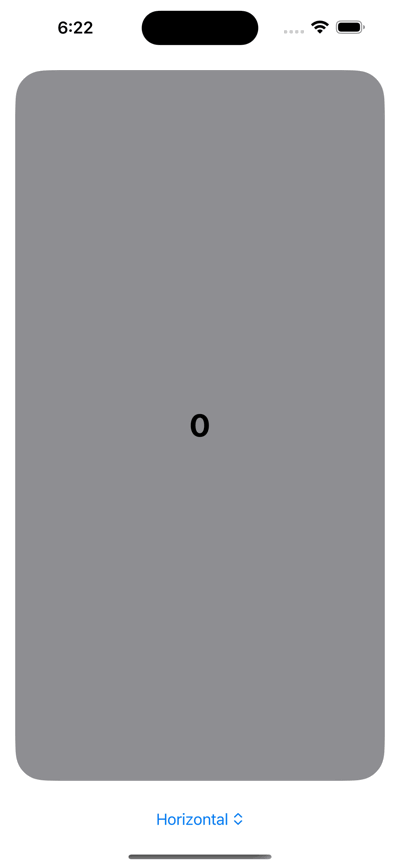

# InfinitePaging

This provides infinite carousel-like paging view in SwiftUI.



## Requirements

- Development with Xcode 16.2+
- Written in Swift 6.0
- Compatible with iOS 17.0+

## Usage

1. Define a structure conforming to Pageable.

```swift
import Foundation
import InfinitePaging

struct Page: Pageable {
    var id = UUID()
    var number: Int
}
```

2. Use InfinitePagingView

```swift
import SwiftUI
import InfinitePaging

struct ContentView: View {
    // Prepare three elements to display at first.
    @State var pages: [Page] = [
        Page(number: -1),
        Page(number: 0),
        Page(number: 1)
    ]

    var body: some View {
        InfinitePagingView(
            objects: $pages,
            pageAlignment: .horizontal,
            pagingHandler: { paging($0) },
            content: { pageView($0) }
        )
    }

    // Define the View that makes up one page.
    private func pageView(_ page: Page) -> some View {
        Text(String(page.number))
            .font(.largeTitle)
            .fontWeight(.bold)
            .frame(maxWidth: .infinity, maxHeight: .infinity)
            .background(Color.gray)
            .clipShape(RoundedRectangle(cornerRadius: 32))
            .padding()
    }

    // Shifts the array element by one when a paging request comes.
    private func paging(_ pageDirection: PageDirection) {
        switch pageDirection {
        case .backward:
            if let number = pages.first?.number {
                pages.insert(Page(number: number - 1), at: 0)
                pages.removeLast()
            }
        case .forward:
            if let number = pages.last?.number {
                pages.append(Page(number: number + 1))
                pages.removeFirst()
            }
        }
    }
}
```

## Privacy Manifest

This library does not collect or track user information, so it does not include a PrivacyInfo.xcprivacy file.
